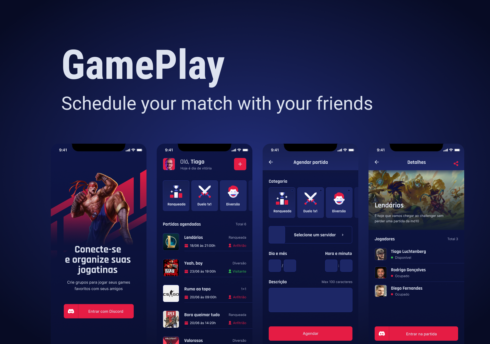

<h1 align="center">
  
</h1>

<p align="center">
  <a href="#technologies">Technologies</a>&nbsp;&nbsp;&nbsp;|&nbsp;&nbsp;&nbsp;
  <a href="#project">Project</a>&nbsp;&nbsp;&nbsp;|&nbsp;&nbsp;&nbsp;
  <a href="#layout">Layout</a>&nbsp;&nbsp;&nbsp;|&nbsp;&nbsp;&nbsp;
  <a href="#usage">Usage</a>
</p>

<h1 align="center">
  
</h1>

## Technologies
This project used the following technologies:

- [React Native](https://reactnative.dev/)
- [TypeScript](https://www.typescriptlang.org/)
- [Axios](https://github.com/axios/axios)

## Project
GamePlay allows you to schedule matches with your friends, so that you can't forget about it. The project was built during the [Next Level Week](https://rocketseat.com.br/) event.

## Layout
You can access the Figma template [here](https://www.figma.com/file/79blYtZEX6qDAU811rB2bE/GamePlay?node-id=58913%3A83).

## Usage
Since this app uses Discord's oAuth2 login strategy, you'll need to access the [Discord Developers](https://discord.com/developers/applications) page and create an application. After creating the application you need to create a `.env` file to set your environment variables.

Here's a template of the environment variables you'll need to set:
```javascript
REDIRECT_URI=YOUR_REDIRECT_URI
SCOPE=YOUR_SCOPE
RESPONSE_TYPE=token
CLIENT_ID=YOUR_CLIENT_ID
CDN_IMAGE=https://cdn.discordapp.com
```

After that you can run `yarn` to install all the dependencies and then run `expo start` to start the project.